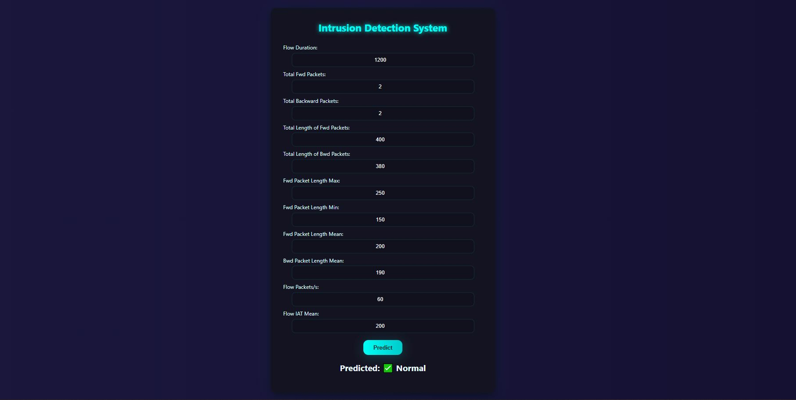
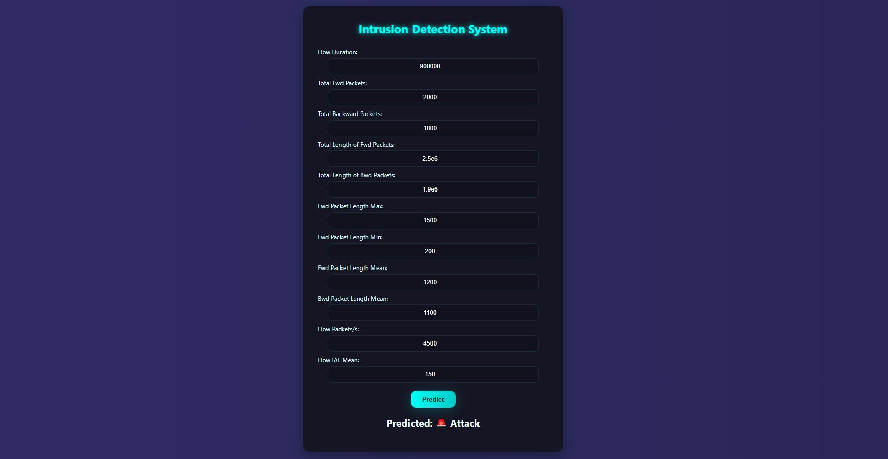

# 🛡️ Intrusion Detection System (IDS)

A Machine Learning-based Intrusion Detection System that classifies network flows as Normal ✅ or Attack ⚠️.
Built using Python, scikit-learn, and Flask, this project provides quick, real-time attack predictions through a simple web interface.

## 🔹 Key Features

- Interactive Flask web dashboard to input flow features and get live predictions 💻
- Includes a ready-to-use demo dataset (data/demo_flows.csv) with labeled Normal (0) and Attack (1) flows 📊
- Trained using Random Forest Classifier for high accuracy and stability 🤖

## 🛠️ Tools & Libraries Used

- Python 3.8+ 🐍	Programming language
- pandas 📝	Data handling and cleaning
- numpy 🔢	Numerical computations
- scikit-learn 🤖	Machine learning (RandomForestClassifier)
- joblib 💾	Model saving/loading
- Flask 🌐	Web interface for real-time prediction

  
## 🚀 How to Run the Project

- Clone or download this repository.
- Open a terminal inside the project folder.
- (Optional) Create and activate a virtual environment:

conda create -n ids_env python=3.10
conda activate ids_env

- Install dependencies:

pip install -r requirements.txt

- Train the model (optional):

python prepare_and_train.py

This will train the model using the dataset and save it as model_rf.pkl.

- Run the Flask app:

python app.py

Open your browser and visit 👉 http://127.0.0.1:5000

## 🧪 Example Predictions
Input Example	Result
Flow Duration = 1200, 
Total Fwd Packets = 2, 
Total Bwd Packets = 2, 
Total Length of Fwd Packets = 400, 
Total Length of Bwd Packets = 380, 
Fwd Packet Length Max = 250, 
Fwd Packet Length Min = 150, 
Fwd Packet Length Mean = 200, 
Bwd Packet Length Mean  = 190, 
Flow Packets/s = 60, 
Flow IAT Mean: 200	✅ Normal

Flow Duration = 900000, 
Total Fwd Packets = 2000, 
Total Bwd Packets = 1800, 
Total Length of Fwd Packets = 2.5e6, 
Total Length of Bwd Packets = 1.9e6, 
Fwd Packet Length Max = 1500, 
Fwd Packet Length Min = 200, 
Fwd Packet Length Mean = 1200, 
Bwd Packet Length Mean  = 1100, 
Flow Packets/s = 4500, 
Flow IAT Mean: 150	⚠️ Attack

You can enter similar values in the Flask web form to test the prediction.

## 📸 Screenshots

### ✅ Normal Detection Example

### ⚠️ Attack Detection Example

## 📁 Project Structure
📦 ids_project
 ┣ 📂 data
 ┃ ┗ 📄 demo_flows.csv
 ┣ 📄 app.py
 ┣ 📄 prepare_and_train.py
 ┣ 📄 predict.py
 ┣ 📄 model_rf.pkl
 ┣ 📄 utils.py
 ┣ 📄 requirements.txt
 ┗ 📄 README.md

## 💡 Notes

- The model is already trained — you can directly launch app.py and start testing.
- Enter flow features in the web UI to get instant predictions.

👩‍💻 Author

Vempali Hrishita
All rights reserved © 2025
